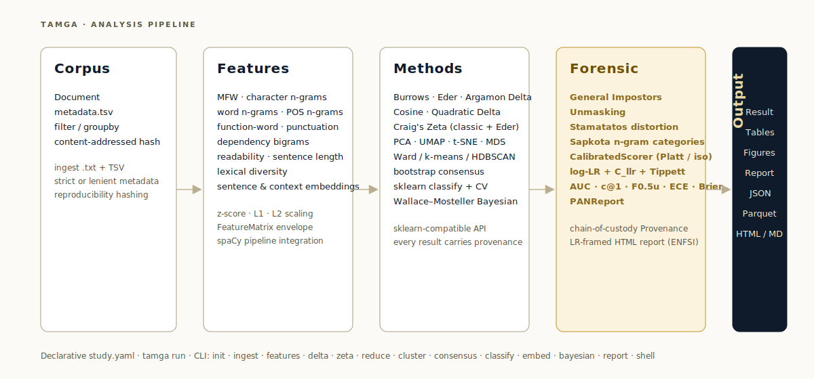
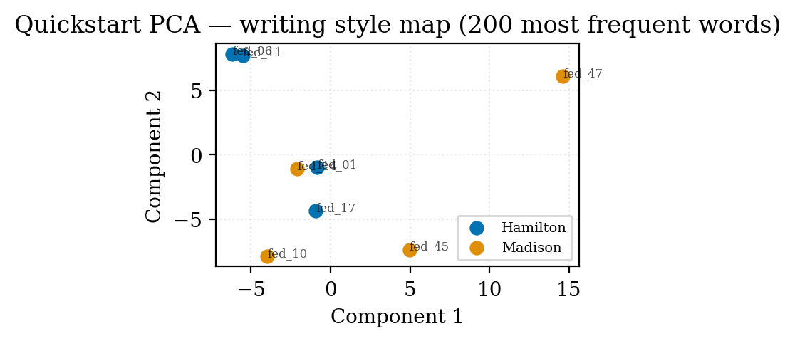

<p align="center">
  
</p>

<p align="center">
  <a href="LICENSE"></a>
  <a href="pyproject.toml"></a>
  <a href="https://fatihbozdag.github.io/tamga/"></a>
  
  
  
</p>

---

`tamga` ("mark, brand, clan-sign" — from Old Turkic) is a Python package and interactive CLI
for **authorship attribution**, **author-group style comparison**, and **forensic-linguistic
analysis**. It reimplements the analytical breadth of R's `Stylo`, then adds a modern NLP
pipeline (spaCy, transformer embeddings), a Bayesian layer (PyMC), and a full forensic-
evidential toolkit on top.

> Named after the **tamga**, the Turkic clan-mark by which individual and familial identity
> was recognised at a glance — the material-culture counterpart to a stylistic fingerprint.

## Architecture

<p align="center">
  
</p>

Every layer is sklearn-compatible; every `Result` carries full provenance (corpus hash,
feature hash, seed, spaCy version, timestamp, resolved config), so a study written as
`study.yaml` is reproducible to the exact random draw years later.

## Install

```bash
uv pip install tamga
python -m spacy download en_core_web_trf
```

Optional extras:

```bash
uv pip install "tamga[bayesian]"    # PyMC + arviz for hierarchical models
uv pip install "tamga[embeddings]"  # sentence-transformers + contextual BERT
uv pip install "tamga[viz]"         # plotly, kaleido, ete3
uv pip install "tamga[reports]"     # weasyprint for PDF export
uv pip install "tamga[turkish]"     # spacy-stanza + Stanza for Turkish pipelines
```

## Quickstart

```bash
tamga init my-study
cd my-study
# drop .txt files into corpus/
# add metadata.tsv mapping filename → author, group, year, ...
tamga ingest corpus/ --metadata corpus/metadata.tsv
tamga info
tamga run study.yaml --name demo
tamga report results/demo --output results/demo/report.html
```

A complete beginner-friendly walkthrough using 9 Federalist Papers (including the disputed
No. 50) lives at [`examples/quickstart/`](examples/quickstart/). The full 85-paper analysis
reproducing the classic Mosteller & Wallace (1964) result is at
[`examples/federalist/`](examples/federalist/).

### Example output

PCA on 200 MFW, trained on known-author Federalist Papers; the disputed #50 is projected
into the same space and lands among the Madison cluster — matching the historical consensus.

<p align="center">
  
</p>

## Capabilities at a glance

| Layer | What's included |
|---|---|
| **Languages** | EN, TR, DE, ES, FR — first-class. Turkish via Stanford Stanza (BOUN) through `spacy-stanza`; the rest via official spaCy `_trf` pipelines. Per-language function words, readability formulas, and contextual/sentence embedding defaults |
| **Corpus** | `.txt` ingestion + TSV metadata, strict/lenient mode, `filter`, `groupby`, content-addressed hashing, language-stamped |
| **Features** | MFW, char n-grams, word n-grams, POS n-grams, dependency bigrams, function words, punctuation, readability (English 6 + TR/DE/ES/FR native), sentence length, lexical diversity (eight indices), sentence + contextual embeddings |
| **Methods** | Burrows / Eder / Argamon / Cosine / Quadratic Delta; Zeta (classic + Eder); PCA / MDS / UMAP / t-SNE; Ward / k-means / HDBSCAN; bootstrap consensus trees; sklearn classify with stylometry-aware CV; Bayesian Wallace-Mosteller + hierarchical group comparison |
| **Forensic** | General Impostors verification, Unmasking, Stamatatos distortion, Sapkota char-n-gram categories, CalibratedScorer, log-LR + C_llr + AUC + c@1 + F0.5u + ECE + Brier + Tippett, PANReport, chain-of-custody Provenance, LR-framed HTML report (ENFSI / Nordgaard verbal scale) |
| **Output** | Uniform `Result` record → JSON + Parquet + figures; Jinja2 HTML / Markdown report; publication-grade matplotlib with 300-DPI colourblind palette |

## Multi-language support

Five first-class languages behind a single `tamga.languages` registry — English, Turkish,
German, Spanish, French. Language flows through `Corpus.language` and drives per-language
defaults for function words, readability formulas, and embedding models:

```bash
uv pip install "tamga[turkish]"
python -c "import stanza; stanza.download('tr')"
tamga init demo-tr --language tr
tamga ingest corpus/ --language tr --metadata corpus/metadata.tsv
tamga run study.yaml --name first-run
```

Turkish parsing goes through Stanford Stanza (BOUN treebank) wrapped by `spacy-stanza` — it
returns native spaCy `Doc` objects, so every tamga feature extractor works unchanged. Native
readability formulas are implemented for each language (Ateşman + Bezirci–Yılmaz for Turkish,
Flesch-Amstad + Wiener Sachtextformel for German, Fernández-Huerta + Szigriszt-Pazos for
Spanish, Kandel–Moles + LIX for French). Function-word lists are regenerated reproducibly from
Universal Dependencies treebanks via `scripts/regenerate_function_words.py`. See
[`docs/site/concepts/languages.md`](docs/site/concepts/languages.md) and the
[Turkish tutorial](docs/site/tutorials/turkish.md).

## Forensic toolkit

Forensic authorship research needs more than attribution — it needs **one-class
verification**, **topic-invariant features**, and **evidential output framed as a
likelihood ratio**. `tamga.forensic` ships these as a cohesive layer on top of the analysis
methods:

```python
from tamga.forensic import (
    GeneralImpostors, Unmasking,        # verification
    CategorizedCharNgramExtractor,      # Sapkota 2015 topic-invariant features
    distort_corpus,                     # Stamatatos 2013 content masking
    CalibratedScorer,                   # Platt / isotonic calibration
    compute_pan_report,                 # AUC + c@1 + F0.5u + Brier + ECE + (cllr)
)
from tamga.report import build_forensic_report  # LR-framed report template
```

Every forensic method is classifier-agnostic — pair it with any tamga feature set and any
Delta / Zeta / classify method. Every `Result` can carry six optional chain-of-custody
metadata fields (`questioned_description`, `known_description`, `hypothesis_pair`,
`acquisition_notes`, `custody_notes`, `source_hashes`) so a report traces back to its source
material. See [`src/tamga/forensic/`](src/tamga/forensic/) for the full surface.

## Documentation

Full MkDocs Material site — **<https://fatihbozdag.github.io/tamga/>**

- [Getting started](https://fatihbozdag.github.io/tamga/getting-started/) — install, five-command quickstart
- [Concepts](https://fatihbozdag.github.io/tamga/concepts/) — Corpus / Features / Languages / Methods / Results & provenance
- [Languages](https://fatihbozdag.github.io/tamga/concepts/languages/) — EN / TR / DE / ES / FR registry, adding a sixth language
- [Forensic toolkit](https://fatihbozdag.github.io/tamga/forensic/) — verification, calibration, topic-invariance, PAN evaluation, reporting
- [Turkish tutorial](https://fatihbozdag.github.io/tamga/tutorials/turkish/) — end-to-end Turkish authorship walkthrough
- [PAN-CLEF verification tutorial](https://fatihbozdag.github.io/tamga/tutorials/pan-clef/) — end-to-end runnable pipeline
- [Federalist tutorial](https://fatihbozdag.github.io/tamga/tutorials/federalist/) — reproduce Mosteller & Wallace (1964)
- [CLI + API reference](https://fatihbozdag.github.io/tamga/reference/)

Serve locally:

```bash
uv pip install "tamga[docs]"
mkdocs serve             # http://127.0.0.1:8000
```

CI (`.github/workflows/docs.yml`) builds the site strictly on every push + PR and
deploys to GitHub Pages on every merge to `main`.

## Status

**Phase 5 landed** — visualisation, Jinja2 reports, declarative runner (`tamga run`), and a
Rich-based interactive `tamga shell`.

**Forensic phase landed** — six additions (General Impostors, LR + calibration + evaluation
metrics, Sapkota categories + Stamatatos distortion, Unmasking, chain-of-custody + forensic
report template, PAN harness).

**Multi-language phase landed** — first-class support for English, Turkish, German, Spanish,
French behind a `tamga.languages` registry. Turkish parses through Stanford Stanza (BOUN
treebank) via `spacy-stanza`, returning native spaCy `Doc` objects so every feature extractor
works unchanged. Native readability formulas per language (Ateşman + Bezirci–Yılmaz for
Turkish, Flesch-Amstad + Wiener Sachtextformel for German, Fernández-Huerta + Szigriszt-Pazos
for Spanish, Kandel–Moles + LIX for French). Function-word lists generated reproducibly from
UD closed-class tokens.

**Docs site landed** — MkDocs Material site with Concepts, Forensic toolkit, Federalist +
PAN-CLEF + Turkish tutorials, and CLI/API reference. **417 tests passing.**

**Docs site is multilingual** — English (default) and Turkish (`/tr/`) launched via
`mkdocs-static-i18n`; DE/ES/FR infrastructure ready, translation content deferred.

**Remaining** — PyPI publish.

See [`docs/superpowers/specs/2026-04-17-tamga-stylometry-package-design.md`](docs/superpowers/specs/2026-04-17-tamga-stylometry-package-design.md) for the full design.

## License

BSD-3-Clause. See [`LICENSE`](LICENSE).

## Citation

If you use tamga in published work, please cite it — see [`CITATION.cff`](CITATION.cff).

## References

The forensic toolkit implements methods from the following peer-reviewed sources:

- Koppel, M., & Winter, Y. (2014). Determining if two documents are written by the same
  author. *JASIST*, 65(1), 178–187.
- Koppel, M., & Schler, J. (2004). Authorship verification as a one-class classification
  problem. *Proceedings of ICML 2004*, 489–495.
- Sapkota, U., Bethard, S., Montes-y-Gómez, M., & Solorio, T. (2015). Not all character
  n-grams are created equal. *Proceedings of NAACL-HLT 2015*, 93–102.
- Stamatatos, E. (2013). On the robustness of authorship attribution based on character
  n-gram features. *Journal of Law and Policy*, 21(2), 421–439.
- Brümmer, N., & du Preez, J. (2006). Application-independent evaluation of speaker
  detection. *Computer Speech & Language*, 20(2–3), 230–275.
- Peñas, A., & Rodrigo, A. (2011). A simple measure to assess non-response. *Proceedings of
  ACL-HLT 2011*, 1415–1424.
- Platt, J. C. (1999). Probabilistic outputs for SVMs and comparisons to regularized
  likelihood methods. *Advances in Large Margin Classifiers*, 61–74.
- ENFSI (2015). *Guideline for evaluative reporting in forensic science*; Nordgaard, A.,
  Ansell, R., Drotz, W., & Jaeger, L. (2012). Scale of conclusions for the value of
  evidence. *Law, Probability and Risk*, 11(1), 1–24.
