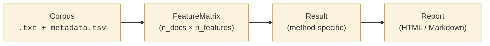

# Concepts

## What tamga is for

tamga answers three questions about who wrote a text:

- **Attribution** — which of a set of candidate authors most likely wrote this document?
- **Verification** — was this document written by *this specific* person?
- **Group comparison** — how does one author's style differ from another's, or from a
  defined group?

On top of those core questions it ships a forensic layer: calibrated likelihood ratios,
chain-of-custody metadata, and evaluation metrics tuned for courtroom use.

Not sure which question you're asking? **[Start with the Choosing a method
guide](choosing.md).**

## The four layers

tamga is organised around four layers, each with one primary return type. Understanding
these four types lets you compose anything tamga can do:

| Layer | Type | Purpose |
|---|---|---|
| Corpus | `Corpus` (wraps `Document`s) | texts + metadata |
| Features | `FeatureMatrix` | numeric document-feature table |
| Methods | `Result` | outcome of an analysis |
| Reporting | report file | publication- or forensic-ready artifact |

## The pipeline

Each arrow is a boundary where data serialises cleanly to disk:

- **Corpus → FeatureMatrix**: cached parquet + spaCy DocBin.
- **FeatureMatrix → Result**: every result directory contains `result.json` + optional
  `table_*.parquet` + figures.
- **Result → Report**: Jinja2 templates render the result directory to a single HTML or
  Markdown file.

## Provenance, everywhere

Every `Result` carries a `Provenance` record with:

- tamga version, Python version, spaCy model + version
- corpus hash (content-addressed)
- feature hash (config + corpus hash)
- seed used for the run
- timestamp
- resolved `study.yaml` config

Plus six optional forensic fields (questioned / known descriptions, hypothesis pair,
acquisition + custody notes, source-file SHA-256s) for chain-of-custody.

Two runs of the same `study.yaml` against the same corpus produce byte-identical
`result.json` under matching seeds. See [Results & provenance](results.md).

## Read next

- [Corpus](corpus.md) — ingestion, metadata, filtering
- [Features](features.md) — what's available, when to use each
- [Methods](methods.md) — Delta, Zeta, classify, Bayesian
- [Results & provenance](results.md) — the shared return type + reproducibility
