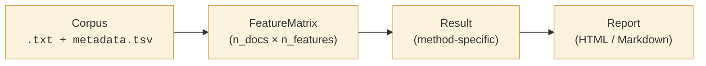

# Kavramlar

## bitig ne işe yarar

bitig, bir metni kimin yazdığına dair üç soruyu yanıtlar:

- **Yazar tespiti** — bir aday yazar kümesinden hangisinin bu belgeyi yazma olasılığı
  en yüksektir?
- **Yazar doğrulama** — bu belgeyi *bu kişi* mi yazdı?
- **Grup karşılaştırması** — bir yazarın biçemi, bir başkasının biçeminden ya da
  tanımlanmış bir gruptan nasıl ayrılır?

Bu temel soruların üstünde bir adli katman yer alır: kalibre edilmiş olabilirlik oranları,
delil zinciri üstverisi ve mahkeme kullanımına göre ayarlanmış değerlendirme ölçütleri.

Hangi soruyu sorduğunuzdan emin değil misiniz? **[Yöntem seçimi rehberiyle
başlayın](choosing.md).**

## Dört katman

bitig dört katman etrafında düzenlenmiştir; her katmanın birincil bir dönüş türü vardır. Bu dört türü anlamak, bitig'nın yapabildiği her şeyi oluşturmanıza olanak tanır:

| Katman | Tür | Amaç |
|---|---|---|
| Corpus | `Corpus` (`Document` listesini sarar) | metinler + üst veri |
| Features | `FeatureMatrix` | sayısal belge-öznitelik tablosu |
| Methods | `Result` | bir analizin çıktısı |
| Reporting | rapor dosyası | yayına veya adli incelemeye hazır çıktı |

## İşlem hattı

Her ok, verinin diske düzgünce serileştirildiği bir sınırı temsil eder:

- **Corpus → FeatureMatrix**: önbellekte parquet + spaCy DocBin.
- **FeatureMatrix → Result**: her sonuç dizini `result.json` + isteğe bağlı `table_*.parquet` + şekiller içerir.
- **Result → Report**: Jinja2 şablonları, sonuç dizinini tek bir HTML veya Markdown dosyasına dönüştürür.

## Her yerde köken bilgisi

Her `Result`, şunları içeren bir `Provenance` kaydı taşır:

- bitig sürümü, Python sürümü, spaCy modeli + sürümü
- derlem özeti (içerik tabanlı özetleme)
- öznitelik özeti (yapılandırma + derlem özeti)
- çalıştırmada kullanılan seed değeri
- zaman damgası
- çözümlenmiş `study.yaml` yapılandırması

Bunlara ek olarak altı isteğe bağlı adli dilbilim alanı (sorgulanan / bilinen belgeler için açıklamalar, hipotez çifti, elde etme + delil zinciri notları, kaynak dosyaların SHA-256 özetleri) bulunur.

Aynı `study.yaml`'ın aynı derlem üzerinde iki ayrı çalıştırılması, eşleşen seed değerleriyle bayt düzeyinde özdeş `result.json` üretir. Bkz. [Sonuçlar ve köken bilgisi](results.md).

## Sonraki adım

- [Corpus](corpus.md) — içe aktarma, üst veri, filtreleme
- [Features](features.md) — mevcut öznitelikler ve kullanım durumları
- [Methods](methods.md) — Delta, Zeta, sınıflandırma, Bayesian
- [Sonuçlar ve köken bilgisi](results.md) — ortak dönüş türü + yeniden üretilebilirlik
