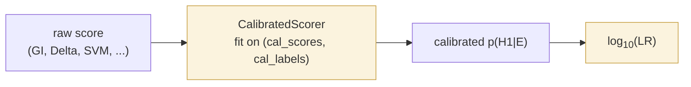

# Calibration & LR output

*Use when:* your verifier outputs raw scores (distances, fractions, probabilities)
that need to be turned into calibrated log-likelihood ratios before an evidential
report.
*Don't use when:* your scorer is already a well-calibrated LR — skip straight to
evaluation.
*Expect:* a scorer wrapper whose `predict_proba` / `log_lr` outputs are
probability-calibrated against a labelled development set.

Raw scores from a verifier are rarely honest probabilities out-of-the-box. This page
covers the two standard post-hoc calibration methods plus the chain-of-custody
metadata that turns a calibrated score into a court-ready LR statement.

Verification systems produce raw scores. Forensic reporting expects **calibrated
posteriors** converted to **likelihood ratios** — the evidential semantics courts
understand. `bitig.forensic` provides both steps.

## The workflow



The calibration fold must be **separate** from the test fold. Overfitting the calibrator
on the test set gives optimistic C_llr and ECE.

## CalibratedScorer

*Use when:* you want to wrap any scorer (`GeneralImpostors`, `Unmasking`, a custom
Delta classifier) so it produces calibrated probabilities and log-LRs in one call.
*Don't use when:* your upstream scorer already emits calibrated output.
*Expect:* `score(q, k)` returns raw; `predict_proba(q, k)` returns calibrated
probability; `log_lr(q, k)` returns the evidential quantity.

Wraps a 1-D monotone calibrator — either Platt (logistic) or isotonic.

```python
from bitig.forensic import CalibratedScorer

scorer = CalibratedScorer(method="platt").fit(calibration_scores, calibration_labels)
probs   = scorer.predict_proba(test_scores)
log_lrs = scorer.predict_log_lr(test_scores, base=10.0)
```

### Choosing the method

| Method | When |
|---|---|
| `"platt"` | Small calibration sets (< 100 / class). Parametric; assumes sigmoidal mapping. Robust. |
| `"isotonic"` | Larger calibration sets (≥ 100 / class). Non-parametric; flexible. |

Both are monotone — rank order of inputs is preserved, so AUC is unchanged.

### Platt calibration

*Use when:* your scorer's decision boundary is approximately linear in log-odds —
logistic-regression-like shape. Fewer parameters than isotonic; needs fewer labelled
trials.
*Don't use when:* your score-to-probability relationship is non-monotonic or sharply
bent — Platt's sigmoid will underfit.
*Expect:* a scalar-parameter sigmoid fit; `predict_proba` outputs calibrated
probabilities via `1 / (1 + exp(a*score + b))`.

### Isotonic calibration

*Use when:* your scorer's decision boundary is non-linear and you have enough
labelled trials (≥500) to fit a non-parametric curve.
*Don't use when:* your dev set is small — isotonic overfits with few points.
*Expect:* a piecewise-constant calibration function; `predict_proba` outputs the
monotone increasing step function.

## Log-LR conversion

Under flat priors ($p(H_1) = p(H_0) = 0.5$), log-LR is just the logit of the calibrated
posterior:

$$
\log_{10}(\text{LR}) = \log_{10}\left(\frac{p(H_1 \mid E)}{1 - p(H_1 \mid E)}\right)
$$

```python
from bitig.forensic import log_lr_from_probs, log_lr_from_probs_with_priors

log_lrs = log_lr_from_probs(probs)                                # flat priors
log_lrs = log_lr_from_probs_with_priors(probs, prior_target=0.3)  # non-flat
```

Use `log_lr_from_probs_with_priors` when the calibration set was NOT balanced — the
function corrects the reported LR back to prior-free magnitudes.

## Verbal scale

Report log-LR magnitudes alongside the six-band Nordgaard et al. (2012) / ENFSI (2015)
scale:

| log₁₀(LR) | Verbal support |
|---|---|
| 0 – 1 | weak |
| 1 – 2 | moderate |
| 2 – 3 | moderately strong |
| 3 – 4 | strong |
| 4 – 5 | very strong |
| > 5 | extremely strong |

The `build_forensic_report` template renders this scale automatically beside each
method's LR value. See [Reporting](reporting.md).

## Reference

::: bitig.forensic.lr.CalibratedScorer
    options:
      show_root_full_path: false

::: bitig.forensic.lr.log_lr_from_probs

::: bitig.forensic.lr.log_lr_from_probs_with_priors
