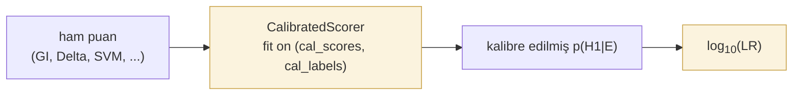

# Kalibrasyon ve LR çıktısı

*Şu durumda kullanın:* doğrulayıcınız ham puanlar (mesafeler, kesirler, olasılıklar) üretiyorsa ve bunların adli rapora geçmeden önce kalibre edilmiş log-olabilirlik oranlarına dönüştürülmesi gerekiyorsa.
*Şu durumda kullanmayın:* puanlayıcınız zaten iyi kalibre edilmiş bir LR üretiyorsa — doğrudan değerlendirme adımına geçin.
*Beklenen sonuç:* `predict_proba` / `log_lr` çıktıları etiketli bir geliştirme kümesine karşı olasılıksal olarak kalibre edilmiş bir puanlayıcı sarmalayıcısı.

Bir doğrulayıcıdan elde edilen ham puanlar nadiren olduğu gibi güvenilir olasılıklardır. Bu sayfa, iki standart sonradan kalibrasyon yöntemini ve kalibre edilmiş bir puanı mahkemeye hazır bir LR ifadesine dönüştüren delil zinciri meta verilerini ele almaktadır.

Doğrulama sistemleri ham puanlar üretir. Adli raporlama, mahkemelerin anladığı kanıtsal semantik için **kalibre edilmiş posteriorların** **olabilirlik oranlarına (likelihood ratio)** dönüştürülmesini bekler. `bitig.forensic` her iki adımı da sağlar.

## İş akışı



Kalibrasyon katı, test katından **ayrı** olmalıdır. Kalibratörü test kümesi üzerinde aşırı uydurmak, iyimser C_llr ve ECE değerleri üretir.

## CalibratedScorer

*Şu durumda kullanın:* herhangi bir puanlayıcıyı (`GeneralImpostors`, `Unmasking`, özel bir Delta sınıflandırıcısı) tek bir çağrıda kalibre edilmiş olasılıklar ve log-LR üretecek şekilde sarmak istiyorsanız.
*Şu durumda kullanmayın:* üst akış puanlayıcınız zaten kalibre edilmiş çıktı üretiyorsa.
*Beklenen sonuç:* `score(q, k)` ham değer döndürür; `predict_proba(q, k)` kalibre edilmiş olasılık döndürür; `log_lr(q, k)` kanıtsal niceliği döndürür.

1-D monoton kalibratörü sarar — Platt (lojistik) veya isotonic.

```python
from bitig.forensic import CalibratedScorer

scorer = CalibratedScorer(method="platt").fit(calibration_scores, calibration_labels)
probs   = scorer.predict_proba(test_scores)
log_lrs = scorer.predict_log_lr(test_scores, base=10.0)
```

### Yöntem seçimi

| Yöntem | Ne zaman kullanılır |
|---|---|
| `"platt"` | Küçük kalibrasyon kümeleri (sınıf başına < 100). Parametrik; sigmoid eşleme varsayar. Sağlamdır. |
| `"isotonic"` | Daha büyük kalibrasyon kümeleri (sınıf başına ≥ 100). Parametrik olmayan; esnek. |

Her ikisi de monotondur — girdilerin sıra düzeni korunur, dolayısıyla AUC değişmez.

### Platt kalibrasyonu

*Şu durumda kullanın:* puanlayıcınızın karar sınırı log-odds cinsinden yaklaşık doğrusal bir yapıdaysa — lojistik regresyon benzeri bir şekil. İzotonikten daha az parametre gerektirir; daha az etiketli deneme yeterlidir.
*Şu durumda kullanmayın:* puan-olasılık ilişkiniz monoton değilse veya keskin kıvrımlar içeriyorsa — Platt'ın sigmoidi yetersiz kalır.
*Beklenen sonuç:* skaler parametreli sigmoid uyumu; `predict_proba`, `1 / (1 + exp(a*score + b))` aracılığıyla kalibre edilmiş olasılıklar üretir.

### Izotonik kalibrasyon

*Şu durumda kullanın:* puanlayıcınızın karar sınırı doğrusal değilse ve parametrik olmayan bir eğri uydurmak için yeterli etiketli denemeniz varsa (≥500).
*Şu durumda kullanmayın:* geliştirme kümeniz küçükse — izotonik kalibrasyon az nokta ile aşırı uyum sağlar.
*Beklenen sonuç:* parçalı sabit kalibrasyon işlevi; `predict_proba` monoton artan adım fonksiyonu üretir.

## Log-LR dönüşümü

Düzleştirilmiş önsel olasılıklar altında ($p(H_1) = p(H_0) = 0{,}5$), log-LR kalibre edilmiş posteriorun logit değeridir:

$$
\log_{10}(\text{LR}) = \log_{10}\left(\frac{p(H_1 \mid E)}{1 - p(H_1 \mid E)}\right)
$$

```python
from bitig.forensic import log_lr_from_probs, log_lr_from_probs_with_priors

log_lrs = log_lr_from_probs(probs)                                # düz önsel olasılıklar
log_lrs = log_lr_from_probs_with_priors(probs, prior_target=0.3)  # düz olmayan
```

Kalibrasyon kümesi dengeli değilse `log_lr_from_probs_with_priors` kullanın; bu işlev bildirilen LR'yi önsel olasılık etkisinden arındırır.

## Sözel ölçek

Log-LR büyüklüklerini altı bantlı Nordgaard et al. (2012) / ENFSI (2015) sözel ölçeği (verbal scale) ile birlikte raporlayın:

| log₁₀(LR) | Sözel destek |
|---|---|
| 0 – 1 | zayıf |
| 1 – 2 | ılımlı |
| 2 – 3 | ılımlı güçlü |
| 3 – 4 | güçlü |
| 4 – 5 | çok güçlü |
| > 5 | son derece güçlü |

`build_forensic_report` şablonu, bu ölçeği her yöntemin LR değerinin yanında otomatik olarak oluşturur. Bkz. [Raporlama](reporting.md).

## Referans

::: bitig.forensic.lr.CalibratedScorer
    options:
      show_root_full_path: false

::: bitig.forensic.lr.log_lr_from_probs

::: bitig.forensic.lr.log_lr_from_probs_with_priors
