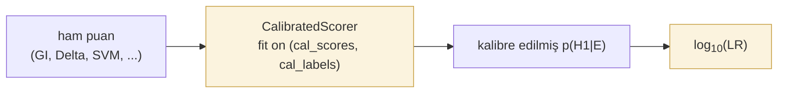

# Kalibrasyon ve LR çıktısı

Doğrulama sistemleri ham puanlar üretir. Adli raporlama, mahkemelerin anladığı kanıtsal semantik için **kalibre edilmiş posteriorların** **olabilirlik oranlarına (likelihood ratio)** dönüştürülmesini bekler. `tamga.forensic` her iki adımı da sağlar.

## İş akışı



Kalibrasyon katı, test katından **ayrı** olmalıdır. Kalibratörü test kümesi üzerinde aşırı uydurmak, iyimser C_llr ve ECE değerleri üretir.

## CalibratedScorer

1-D monoton kalibratörü sarar — Platt (lojistik) veya isotonic.

```python
from tamga.forensic import CalibratedScorer

scorer = CalibratedScorer(method="platt").fit(calibration_scores, calibration_labels)
probs   = scorer.predict_proba(test_scores)
log_lrs = scorer.predict_log_lr(test_scores, base=10.0)
```

### Yöntem seçimi

| Yöntem | Ne zaman kullanılır |
|---|---|
| `"platt"` | Küçük kalibrasyon kümeleri (sınıf başına < 100). Parametrik; sigmoid eşleme varsayar. Sağlamdır. |
| `"isotonic"` | Daha büyük kalibrasyon kümeleri (sınıf başına ≥ 100). Parametrik olmayan; esnek. |

Her ikisi de monotondur — girdilerin sıra düzeni korunur, dolayısıyla AUC değişmez.

## Log-LR dönüşümü

Düzleştirilmiş önsel olasılıklar altında ($p(H_1) = p(H_0) = 0{,}5$), log-LR kalibre edilmiş posteriorun logit değeridir:

$$
\log_{10}(\text{LR}) = \log_{10}\left(\frac{p(H_1 \mid E)}{1 - p(H_1 \mid E)}\right)
$$

```python
from tamga.forensic import log_lr_from_probs, log_lr_from_probs_with_priors

log_lrs = log_lr_from_probs(probs)                                # düz önsel olasılıklar
log_lrs = log_lr_from_probs_with_priors(probs, prior_target=0.3)  # düz olmayan
```

Kalibrasyon kümesi dengeli değilse `log_lr_from_probs_with_priors` kullanın; bu işlev bildirilen LR'yi önsel olasılık etkisinden arındırır.

## Sözel ölçek

Log-LR büyüklüklerini altı bantlı Nordgaard et al. (2012) / ENFSI (2015) sözel ölçeği (verbal scale) ile birlikte raporlayın:

| log₁₀(LR) | Sözel destek |
|---|---|
| 0 – 1 | zayıf |
| 1 – 2 | ılımlı |
| 2 – 3 | ılımlı güçlü |
| 3 – 4 | güçlü |
| 4 – 5 | çok güçlü |
| > 5 | son derece güçlü |

`build_forensic_report` şablonu, bu ölçeği her yöntemin LR değerinin yanında otomatik olarak oluşturur. Bkz. [Raporlama](reporting.md).

## Referans

::: tamga.forensic.lr.CalibratedScorer
    options:
      show_root_full_path: false

::: tamga.forensic.lr.log_lr_from_probs

::: tamga.forensic.lr.log_lr_from_probs_with_priors
