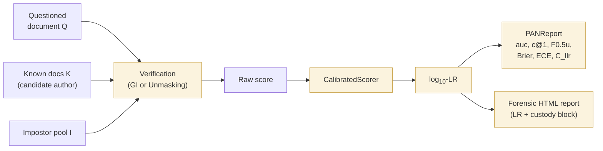

# Forensic toolkit

Forensic authorship research needs more than attribution — it needs **one-class
verification**, **topic-invariant features**, and **evidential output framed as a
likelihood ratio**, calibrated against a reference population.

`tamga.forensic` ships these as a cohesive layer on top of the analysis methods. Every
tool is classifier-agnostic — pair it with any tamga feature set and any Delta / Zeta /
classify method.

## What's in the package

```python
from tamga.forensic import (
    # Verification
    GeneralImpostors,            # Koppel & Winter 2014
    Unmasking,                   # Koppel & Schler 2004

    # Topic-invariant features
    CategorizedCharNgramExtractor,   # Sapkota et al. 2015
    distort_corpus, distort_text,    # Stamatatos 2013

    # Calibration + LR output
    CalibratedScorer,                # Platt / isotonic
    log_lr_from_probs,
    log_lr_from_probs_with_priors,

    # Evaluation metrics (PAN menu)
    auc, c_at_1, f05u, brier, ece, cllr, tippett,
    PANReport, compute_pan_report,
)

from tamga.report import build_forensic_report   # LR-framed HTML template
```

## The forensic workflow



## Why LR framing matters

Forensic journals (IJSLL, *Language and Law*) and courtroom gatekeeping (Daubert in the
US, *R v T* and its successors in the UK) expect evidence framed as a **likelihood
ratio**:

$$
\text{LR} = \frac{P(E \mid H_1)}{P(E \mid H_0)}
$$

— the probability of the evidence under the same-author hypothesis divided by its
probability under different-author, with a **calibrated** underlying scorer. Raw
classifier posteriors are rarely calibrated and are easily abused as "probability of
guilt" in ways that misrepresent forensic semantics.

tamga's `CalibratedScorer` + `log_lr_from_probs` pipeline converts any raw score to a
log-LR defensible in a forensic report, and the bundled ENFSI / Nordgaard verbal scale in
the report template gives a transparent verbal reading.

## Chain of custody

Every `Provenance` record accepts six optional forensic fields:

- `questioned_description` — free-text description of Q
- `known_description` — free-text description of K
- `hypothesis_pair` — e.g. `"H1: authored by X; H0: authored by someone other than X"`
- `acquisition_notes` — how source material was obtained (warrant, image, etc.)
- `custody_notes` — any further chain-of-custody annotations
- `source_hashes` — `dict[document_id, SHA-256]` of the original files

These land in the rendered forensic report under a dedicated *Chain of custody* block.

## Read next

- [Verification](verification.md) — GI + Unmasking
- [Calibration & LR output](calibration.md)
- [Topic-invariant features](topic-invariance.md)
- [Evaluation (PAN suite)](evaluation.md)
- [Reporting](reporting.md)
