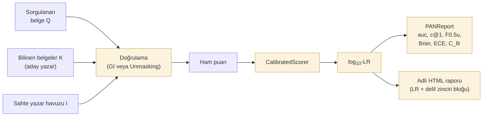

# Adli araç seti

Adli dilbilim (forensic linguistics) araştırmaları yalnızca yazar tespitinin ötesini gerektirir: **tek sınıflı doğrulama**, **konudan bağımsız öznitelikler** ve **referans popülasyona göre kalibre edilmiş olabilirlik oranı (likelihood ratio) olarak biçimlendirilmiş kanıtsal çıktı**.

`tamga.forensic`, bu bileşenleri analiz yöntemlerinin üzerine tutarlı bir katman olarak sunar. Her araç sınıflandırıcıdan bağımsızdır; herhangi bir tamga öznitelik kümesiyle ve herhangi bir Delta / Zeta / classify yöntemiyle birleştirilebilir.

## Pakette neler var

```python
from tamga.forensic import (
    # Doğrulama
    GeneralImpostors,            # Koppel & Winter 2014
    Unmasking,                   # Koppel & Schler 2004

    # Konudan bağımsız öznitelikler
    CategorizedCharNgramExtractor,   # Sapkota et al. 2015
    distort_corpus, distort_text,    # Stamatatos 2013

    # Kalibrasyon + LR çıktısı
    CalibratedScorer,                # Platt / isotonic
    log_lr_from_probs,
    log_lr_from_probs_with_priors,

    # Değerlendirme metrikleri (PAN menüsü)
    auc, c_at_1, f05u, brier, ece, cllr, tippett,
    PANReport, compute_pan_report,
)

from tamga.report import build_forensic_report   # LR tabanlı HTML şablonu
```

## Adli iş akışı



## LR çerçevesinin önemi

Adli dilbilim dergileri (IJSLL, *Language and Law*) ve mahkeme kabul kriterleri (ABD'de Daubert, İngiltere'de *R v T* ve halefleri) kanıtın **olabilirlik oranı (likelihood ratio)** biçiminde sunulmasını bekler:

$$
\text{LR} = \frac{P(E \mid H_1)}{P(E \mid H_0)}
$$

— bu, aynı-yazar hipotezi altında kanıtın olasılığının farklı-yazar altındaki olasılığa oranıdır; bunun için **kalibre edilmiş** bir temel puanlayıcı gereklidir. Ham sınıflandırıcı posteriorları nadiren kalibredir ve adli semantiği yanlış temsil eden "suçluluk olasılığı" biçiminde kolayca kötüye kullanılabilir.

tamga'nın `CalibratedScorer` + `log_lr_from_probs` işlem hattı, herhangi bir ham puanı adli raporda savunulabilir bir log-LR değerine dönüştürür. Rapor şablonundaki yerleşik ENFSI / Nordgaard sözel ölçeği (verbal scale), şeffaf bir sözel okuma sunar.

## Delil zinciri

Her `Provenance` kaydı altı isteğe bağlı adli dilbilim alanını kabul eder:

- `questioned_description` — sorgulanan belge Q'nun serbest metin açıklaması
- `known_description` — bilinen belge K'nın serbest metin açıklaması
- `hypothesis_pair` — ör. `"H1: X tarafından yazıldı; H0: X dışında biri tarafından yazıldı"`
- `acquisition_notes` — kaynak materyalin nasıl elde edildiği (arama kararı, görüntü, vb.)
- `custody_notes` — ek delil zinciri (chain of custody) açıklamaları
- `source_hashes` — orijinal dosyaların `dict[document_id, SHA-256]` özet değerleri

Bu bilgiler, oluşturulan adli raporda ayrılmış bir *Delil zinciri* bloğuna aktarılır.

## Sırada ne var

- [Doğrulama](verification.md) — GI + Unmasking
- [Kalibrasyon ve LR çıktısı](calibration.md)
- [Konudan bağımsız öznitelikler](topic-invariance.md)
- [Değerlendirme (PAN paketi)](evaluation.md)
- [Raporlama](reporting.md)
