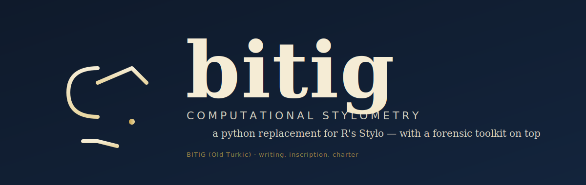
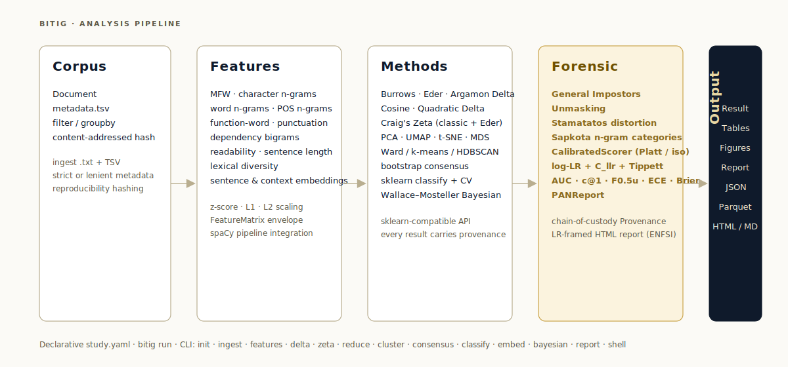

---
hide:
  - navigation
---

# bitig

  

**Yazar tespiti, yazar grubu karşılaştırması ve adli dilbilim analizi için hesaplamalı stilometri.** R'ın `Stylo` paketinin modern bir Python karşılığı; güncel bir NLP işlem hattı (spaCy, transformer gömmeleri), Bayes katmanı (PyMC) ve kapsamlı bir adli dilbilim kanıt araç takımı içerir.

> Adını **bitig**ten alır — Eski Türkçede *yazı* / *yazıt* anlamına gelir; 8. yüzyıl
> Orhon yazıtlarına kazınan türden. Bir bitig, yazarın elini taşıyan bir kayıttı; bu
> paket de o eli arar.

## Mimari

  

Her katman `sklearn` uyumludur; her `Result` tam köken bilgisi taşır (derlem özeti,
öznitelik özeti, tohum, spaCy sürümü, zaman damgası, çözümlenmiş yapılandırma); böylece
`study.yaml` olarak yazılan bir çalışma, yıllar sonra bile tam aynı rastgele çekime
yeniden üretilebilir.

## Hızlı gezinti

-   :fontawesome-solid-rocket:{ .lg .middle } **Başlarken**

    ---

    bitig'yı kurun, ilk derlemizi oluşturun ve CLI'dan bir Burrows Delta çalışması çalıştırın.

    [:octicons-arrow-right-24: Kurulum ve hızlı başlangıç](getting-started.md)

-   :material-book-open-page-variant:{ .lg .middle } **Kavramlar**

    ---

    Derlem → Öznitelikler → Yöntemler → Sonuçlar. İşlem hattının dört katmanı, açıklamalı.

    [:octicons-arrow-right-24: Kavramlar](concepts/index.md)

-   :material-shield-search:{ .lg .middle } **Adli dilbilim araç takımı**

    ---

    General Impostors doğrulama, Unmasking, LR çıktısı ve kalibrasyon, PAN değerlendirme.

    [:octicons-arrow-right-24: Adli dilbilim araç takımı](forensic/index.md)

-   :material-school:{ .lg .middle } **Öğreticiler**

    ---

    Mosteller & Wallace'ın Federalist Papers çalışmasını yeniden üretin; uçtan uca PAN tarzı adli doğrulama yapın.

    [:octicons-arrow-right-24: Öğreticiler](tutorials/index.md)

## Neler var?

| Katman | Öne çıkanlar |
|---|---|
| **Derlem** | `.txt` + TSV meta veri alımı, filtre / grupla, içerik tabanlı özetleme |
| **Diller** | EN / TR / DE / ES / FR tam destek — dile özgü işlev sözcüğü listeleri, okunabilirlik formülleri, bağlamsal/cümle gömme varsayılanları. Türkçe için Stanford Stanza (BOUN) `spacy-stanza` aracılığıyla |
| **Öznitelikler** | MFW, karakter / sözcük / POS n-gram, bağımlılık bigramları, işlev sözcükleri, noktalama, okunabilirlik (EN + TR/DE/ES/FR yerel formüller), cümle uzunluğu, sözcüksel çeşitlilik, cümle + bağlamsal gömmeler |
| **Yöntemler** | Burrows / Eder / Argamon / Cosine / Quadratic Delta; Zeta; PCA / UMAP / t-SNE / MDS; Ward / k-means / HDBSCAN; bootstrap konsensüs; sklearn sınıflandırma + CV; Wallace–Mosteller Bayes |
| **Adli dilbilim** | General Impostors, Unmasking, Stamatatos çarpıtma, Sapkota n-gram kategorileri, Platt / izotonik kalibrasyon, log-LR + C_llr + AUC + c@1 + F0.5u + ECE + Brier + Tippett, PANReport, delil zinciri köken bilgisi, LR tabanlı HTML raporu |

## Durum

**5. aşama tamamlandı** — görselleştirme, Jinja2 raporları, bildirimsel çalıştırıcı (`bitig run`) ve
Rich tabanlı etkileşimli `bitig shell`.

**Adli dilbilim aşaması tamamlandı** — altı ek (General Impostors, LR + kalibrasyon + değerlendirme
ölçütleri, Sapkota kategorileri + Stamatatos çarpıtma, Unmasking, delil zinciri + adli rapor şablonu,
PAN çerçevesi).

**Çok dilli aşama tamamlandı** — `bitig.languages` kayıt defterinin arkasında İngilizce, Türkçe,
Almanca, İspanyolca ve Fransızca için tam destek. Türkçe, Stanford Stanza (BOUN
treebank'ı) aracılığıyla `spacy-stanza` üzerinden çözümlenerek her öznitelik çıkarıcının değişmeden
çalışabileceği yerel spaCy `Doc` nesneleri döndürür. Dile özgü yerel okunabilirlik formülleri
(Türkçe için Ateşman + Bezirci–Yılmaz; Almanca için Flesch-Amstad + Wiener Sachtextformel;
İspanyolca için Fernández-Huerta + Szigriszt-Pazos; Fransızca için Kandel–Moles + LIX).
İşlev sözcüğü listeleri, UD kapalı-sınıf belirteçlerinden yeniden üretilebilir biçimde oluşturulur.

**Dokümantasyon sitesi yayında** — Kavramlar, Adli dilbilim araç takımı, Federalist + PAN-CLEF +
Türkçe öğreticileri ve CLI/API referansını içeren bu MkDocs Material sitesi. **417 test geçiyor.**

**Dokümantasyon sitesi çok dilli** — İngilizce (varsayılan) ve Türkçe (`/tr/`) `mkdocs-static-i18n`
ile yayında; DE/ES/FR altyapısı hazır, çeviri içeriği sonraya bırakıldı.

**Kalan** — PyPI yayını.

## Lisans ve atıf

BSD-3-Clause. Bkz. [`LICENSE`](https://github.com/fatihbozdag/bitig/blob/main/LICENSE).

bitig'yı yayımlanmış bir çalışmada kullanıyorsanız lütfen
[`CITATION.cff`](https://github.com/fatihbozdag/bitig/blob/main/CITATION.cff) aracılığıyla atıf yapın.
