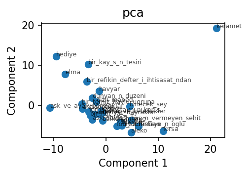
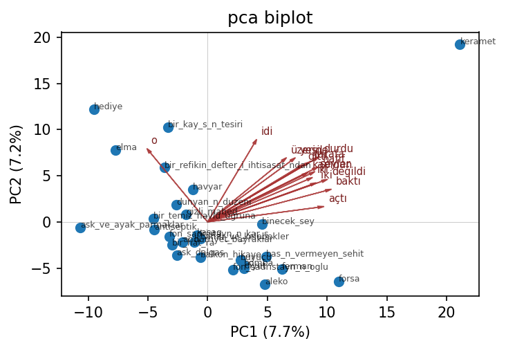
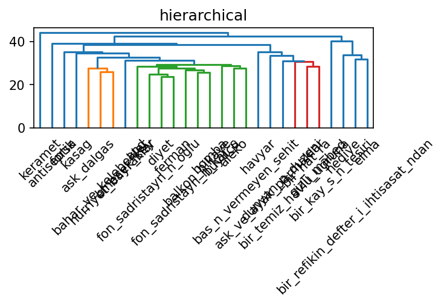

# Turkish stylometry walkthrough

A complete runnable example: attribute a small Turkish short-story corpus using MFW +
Ateşman readability + Burrows Delta. The stories are public-domain Ömer Seyfettin texts from
Turkish Wikisource.

## Setup

```bash
uv pip install 'bitig[turkish]'
python -c "import stanza; stanza.download('tr')"
bitig init seyfettin --language tr
cd seyfettin
```

This scaffolds a project directory with `study.yaml` pre-configured for Turkish. Confirm
with:

```bash
bitig info
```

The `language` row shows `tr`.

## Corpus

Place 3-5 Turkish short stories in `corpus/` as UTF-8 `.txt` files. A good public-domain
source is [Ömer Seyfettin on Turkish
Wikisource](https://tr.wikisource.org/wiki/Yazar:%C3%96mer_Seyfettin) — dozens of early-20th-
century short stories are already transcribed there.

Add a `corpus/metadata.tsv`:

```tsv
filename	author	year
bomba.txt	Omer_Seyfettin	1910
kesik_biyik.txt	Omer_Seyfettin	1911
forsa.txt	Omer_Seyfettin	1913
pembe_incili_kaftan.txt	Omer_Seyfettin	1917
```

A real study would include several authors. For a single-author demo, pair Seyfettin with
a few stories by Refik Halit Karay (also public domain) to give Delta something to
discriminate.

## Running the study

```bash
bitig ingest corpus/ --language tr --metadata corpus/metadata.tsv
bitig run study.yaml --name first-run
```

`bitig ingest` runs Stanza through `spacy-stanza`. The first run parses every document and
caches the DocBins; subsequent runs hit the cache and finish in seconds.

## What you get

A default Turkish study computes:

- **MFW** (top 1000 tokens, z-scored relative frequencies)
- **Turkish function words** — loaded from `resources/languages/tr/function_words.txt`,
  derived from UD Turkish BOUN closed-class tokens
- **Ateşman and Bezirci-Yılmaz** readability indices
- **Burrows Delta** + PCA/MDS reduction plots

The output folder `results/first-run/` contains:

- `result.json` with Delta scores and provenance
- `table_*.parquet` feature matrices
- PNG / PDF figures (distance heatmap, PCA scatter)
- a `provenance.json` that records the corpus hash, seed, and full resolved config

## Worked example: 28 short stories by Ömer Seyfettin

The `examples/turkish_seyfettin/` directory in the repository ships a complete,
end-to-end run against 28 short stories by Ömer Seyfettin (1884-1920; in the
Turkish public domain since 1991), scraped from
[tr.wikisource.org](https://tr.wikisource.org) by `fetch_corpus.py` and committed
alongside the study so the numbers below are reproducible to the exact random
draw.

```bash
python examples/turkish_seyfettin/fetch_corpus.py --n 30   # ~30s, polite to Wikisource
python -m bitig run examples/turkish_seyfettin/study.yaml --name seyfettin
```

**Corpus.** 28 stories survive the >200-token cutoff; story lengths range from
326 to 4 455 tokens (median ≈ 1 700). Wikisource transcriptions are CC BY-SA 4.0;
attribution and source URLs live in `examples/turkish_seyfettin/manifest.json`.

**Study.** Five hundred most frequent words (z-scored, `min_df = 2`) +
Turkish function-word frequencies → Burrows Delta self-attribution + PCA + Ward
hierarchical clustering. Single-author setups don't admit between-author
verification (Imposters / classify), so this is *exploratory within-author
stylometry*, not authorship attribution.

### Burrows Delta self-attribution

Across the 28-story leave-one-out grid, every story's nearest training neighbour
is itself (accuracy = 1.0). For a single-author corpus that's the trivial result
— every document is closer to its own MFW profile than to any other — but it
also confirms that no story has been mistakenly tagged with a different author's
metadata. The interesting signal lives one rank deeper, in the rank-2 nearest
neighbour, which surfaces stylistically adjacent stories. The pairwise distance
matrix used for ranking is preserved in
`results/seyfettin/burrows/result.json`.

### PCA on the MFW-500 lexical space



PC1 explains **7.7 %** of the variance, PC2 explains **7.2 %**. That no
single component dominates is itself diagnostic: lexical variance inside one
author is spread across many small axes rather than concentrated in one or two.
Compare this to a between-author PCA (e.g. the
[Federalist tutorial](federalist.md)) where PC1 alone routinely captures 30 %+.

**Top loadings — PC1**: `baktı`, `değildi`, `açtı`, `durdu`, `hafif`, `iki`, `şeyler`, `gelince`.
PC1 separates stories that lean on simple-past 3rd-person narration verbs
(`baktı`, `açtı`, `durdu`) from those without.

**Top loadings — PC2**: `idi`, `ediyordu`, `onu`, `o`, `olduğu`, `nihayet`, `etti`, `durdu`.
PC2 picks up the past-imperfective auxiliary (`idi`, `ediyordu`) and the
3rd-person pronoun cluster (`onu`, `o`, `olduğu`) — i.e., the choice between
extended-state description and event-driven narration.

The biplot overlays the top-12 loading vectors onto the same 2-D projection:



[Open the interactive plotly biplot ↗](turkish_figures/pca_biplot.html) — hover
to read story IDs and arrowhead labels.

### Ward hierarchical clustering (k = 4)



Cutting at four flat clusters yields:

| Cluster | n  | Member story IDs |
|--------:|---:|---|
| 0       | 23 | the bulk of the corpus (`aleko`, `bomba`, `kasag`, `forsa`, …) |
| 1       |  3 | `bir_refikin_defter_i_ihtisasat_ndan`, `elma`, `hediye` |
| 2       |  1 | `bir_kay_s_n_tesiri` |
| 3       |  1 | `keramet` |

The three-story cluster turns out to be the three shortest pieces in the corpus
(329 / 517 / 457 tokens). The two singletons are also short (554 and 511
tokens). What the dendrogram is mostly surfacing, in other words, is a
**length-driven signal**: z-scored MFW counts get noisy below ~600 tokens, so
short stories drift away from the main cloud regardless of topic. This is not
a bug in the method — it is the natural consequence of MFW estimation variance
at small *N*, and it is the single most useful thing this analysis tells you:

[Open the interactive plotly dendrogram ↗](turkish_figures/ward_dendrogram.html)

> If you are running stylometry on Turkish short prose, raise the per-document
> token floor to at least 1 000 — or move to character n-grams, which are far
> more length-tolerant — before drawing topic / period conclusions from the
> sub-cluster structure.

### Caveats and what is *not* shown here

A genuine **authorship-attribution** demonstration needs at least one
additional PD-old Turkish prose author with comparable Wikisource coverage,
which Wikisource:tr does not currently have for the early-republican period
(Refik Halit Karay's transcriptions are present but the underlying texts
will not enter the Turkish public domain until 2036). For attribution work we
recommend pairing Seyfettin with a different-genre control corpus
(e.g. parliamentary speeches, Türkçe Wikipedia featured articles by topic,
or your own institutional corpus) rather than a contemporaneous literary author.

## Customising

Edit `study.yaml` to swap features or methods. For example, to use contextual embeddings
instead of MFW:

```yaml
features:
  - id: bert_tr
    type: contextual_embedding
    # model auto-resolves to `dbmdz/bert-base-turkish-cased` via the language registry
    pool: mean
```

For a heavier Turkish encoder, point `model:` at any HuggingFace checkpoint:

```yaml
features:
  - id: bert5urk
    type: contextual_embedding
    model: stefan-it/bert5urk
    pool: mean
```

## Notes on Turkish specifics

- **Morphology.** Turkish is agglutinative; a token like `evlerinizden` packs
  `ev+ler+iniz+den` into one form. Stanza's Turkish BOUN model lemmatises and tags these
  correctly, which matters for POS-ngram and dependency-based features.
- **Syllable counting.** Both Ateşman and Bezirci-Yılmaz count syllables using a
  vowel-counter specialised for Turkish orthography (including `ı`, `ğ`, `ş`, `ç`, `ü`,
  `ö`).
- **Function words.** The bundled list leans on Turkish's closed-class postpositions,
  conjunctions, and discourse particles (e.g. `ile`, `ancak`, `fakat`, `çünkü`, `ki`,
  `ise`).

## Troubleshooting

- **`ModuleNotFoundError: No module named 'spacy_stanza'`** — run
  `uv pip install 'bitig[turkish]'`.
- **`FileNotFoundError: ... stanza_resources/tr/default.zip`** — run
  `python -c "import stanza; stanza.download('tr')"`. The model is about 600 MB.
- **Very slow first ingest on MPS.** Stanza's Turkish model does not yet support Apple
  Silicon MPS. Expect CPU parse rates on first run; subsequent runs are cache hits.
