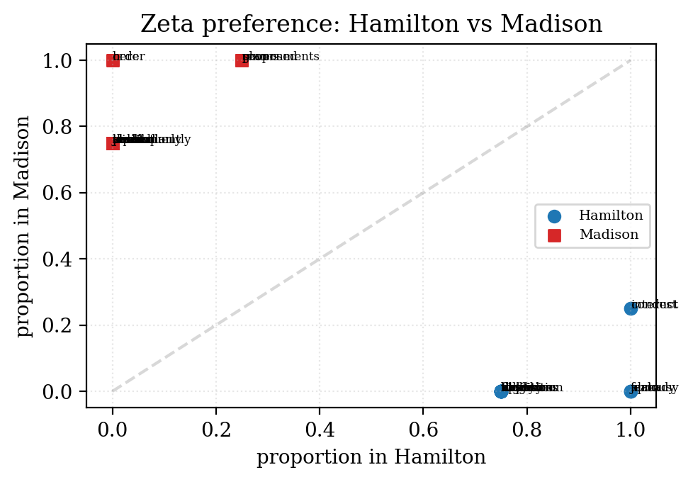

# Quickstart — Who wrote the mystery essay?

A 10-minute, plain-English tour of `bitig`. No stats background required.
You'll run the same techniques scholars use to settle authorship disputes,
on a corpus small enough to eyeball.

## The story

In **1787–1788**, three American statesmen — Alexander Hamilton, James Madison,
and John Jay — wrote 85 newspaper essays to argue for the new U.S. Constitution.
They all signed with the same pseudonym: **Publius**. For eleven of those essays,
nobody knew for sure who wrote what. Scholars argued about it for 170 years.

In **1964**, statisticians Mosteller and Wallace cracked the case by counting
little words like "upon" and "whilst". We'll do a miniature version of their
study here.

## What you need

- Python 3.11+
- `bitig` installed (see the main `README.md` — `uv pip install -e .` from the
  project root also works)
- A terminal

## What's in this folder

```
quickstart/
├── corpus/              ← 9 plain-text essays
│   ├── fed_01.txt       ← Hamilton, known
│   ├── fed_06.txt       ← Hamilton, known
│   ├── fed_11.txt       ← Hamilton, known
│   ├── fed_17.txt       ← Hamilton, known
│   ├── fed_10.txt       ← Madison, known
│   ├── fed_14.txt       ← Madison, known
│   ├── fed_45.txt       ← Madison, known
│   ├── fed_47.txt       ← Madison, known
│   └── fed_50.txt       ← ??? ("Unknown" — the mystery)
├── metadata.tsv         ← who wrote what (fed_50 is marked Unknown)
├── study.yaml           ← the recipe bitig follows
└── render_figures.py    ← turns the numeric results into PNGs
```

There are **four** essays known to be Hamilton's and **four** known to be
Madison's. Our **mystery essay** is Federalist No. 50. Historians disputed this
one for a long time — and we'll see if bitig can pick the author.

---

## Step 1 — Look at one of the essays

Open `corpus/fed_01.txt` in any text editor. It's plain English, 1,600 words,
published in a New York newspaper in October 1787. These are real historical
documents from Project Gutenberg — we only stripped an editor's attribution
header so the author's name isn't literally sitting at the top of the file.

**Why this matters:** bitig looks only at what's *in* the text. If the author's
name were inside the document, we'd be cheating.

---

## Step 2 — Look at the `metadata.tsv`

```
filename    author   role   title
fed_01.txt  Hamilton train  General Introduction
fed_10.txt  Madison  train  The Same Subject Continued (Factions)
...
fed_50.txt  Unknown  test   Periodical Appeals to the People Considered (disputed)
```

Two things to notice:
- **`author`** tells bitig who wrote each essay (where we know).
- **`role`** splits the corpus into `train` (used to learn each author's style)
  and `test` (the mystery, set aside for attribution).

---

## Step 3 — Run the study (one command)

From the repository root:

```bash
bitig run examples/quickstart/study.yaml --name demo
```

This takes about 2 seconds. Under the hood, bitig:

1. Reads the 9 essays.
2. Keeps only the 8 `train` essays (the mystery is held back for later).
3. Counts how often each of the 200 most common English words appears in
   each essay. These numbers become each essay's "fingerprint".
4. Runs three analyses on those fingerprints (see Steps 4–6 below).

The output lands in `examples/quickstart/results/demo/`.

Now turn the numbers into pictures:

```bash
python examples/quickstart/render_figures.py
```

---

## Step 4 — A writing-style map (PCA)

Open `results/demo/pca/pca.png`.


Each dot is one essay. Blue = Hamilton, orange = Madison. The axes have no
real-world meaning — they're just the two directions along which the eight
essays differ most. What matters is **which essays sit near each other**.

Hamilton's four essays land on the **left** half of the map. Madison's four
essays land on the **right** half. Two different writing styles, two different
neighbourhoods. That's already strong evidence there *is* a measurable style
difference we can exploit for the mystery.

> **In plain English:** PCA is like sorting books by smell. You can't describe
> the axes, but books by the same author end up in the same corner of the shelf.

---

## Step 5 — The tell-tale words (Craig's Zeta)

Open `results/demo/zeta/zeta.png`.



This plot lists the words that most distinguish the two authors. The
**top-left corner** shows words Madison uses in every essay that Hamilton never
uses. The **bottom-right corner** shows Hamilton's habits that Madison avoids.

From the underlying table (`zeta/table_0.parquet`), the top fingerprints are:

| Hamilton likes to say …  | Madison likes to say …        |
|--------------------------|-------------------------------|
| upon                     | here                          |
| already                  | order                         |
| fact                     | thus                          |
| jealousy                 | modern                        |
| kind, mere, furnish      | judicial, elected, consequently |

The word **"upon"** is the most famous tell in this corpus — Hamilton used it
constantly, Madison barely at all. Mosteller and Wallace noticed the same
thing in 1964.

> **In plain English:** everyone has favourite filler words. When you count
> enough of them, you get a writer's thumbprint.

---

## Step 6 — Attribute the mystery essay

Now the moment of truth. Run:

```bash
bitig delta examples/quickstart/corpus \
    --method burrows --mfw 200 \
    --metadata examples/quickstart/metadata.tsv \
    --group-by author --test-filter role=test
```

bitig compares fed_50's fingerprint against the average Hamilton fingerprint
and the average Madison fingerprint. Whichever is closer wins.

You should see:

```
        Delta attribution — method=burrows, mfw=200
┏━━━━━━━━┳━━━━━━━━━━━━━━━━━━━┳━━━━━━━━━━━━━━━━━━━━┳━━━━━━━┓
┃ doc_id ┃ author (observed) ┃ author (predicted) ┃ match ┃
┡━━━━━━━━╇━━━━━━━━━━━━━━━━━━━╇━━━━━━━━━━━━━━━━━━━━╇━━━━━━━┩
│ fed_50 │ Unknown           │ Madison            │ no    │
└────────┴───────────────────┴────────────────────┴───────┘
```

- **`author (predicted): Madison`** — bitig thinks Madison wrote fed_50.
- **`match: no`** — bitig is comparing the prediction against our label
  `Unknown`, which isn't "Madison", so it reports "no" match. That's fine —
  the prediction itself is what we care about.

**This matches the Mosteller–Wallace (1964) conclusion and the modern
scholarly consensus**: Madison is the author of Federalist No. 50.

> **In plain English:** we lined up the mystery essay next to every known
> essay and asked "whose style is this closest to?" The answer was Madison.

---

## Step 7 — (Optional) The full report

```bash
bitig report examples/quickstart/results/demo \
    --output examples/quickstart/results/demo/report.html \
    --title "Quickstart — Who wrote the mystery essay?"
```

Open `results/demo/report.html` in a browser — you'll get a single page with
the figures, the feature table, and every parameter the run used (for
reproducibility).

---

## What you just did

You used three different techniques that together form the foundation of
computational stylometry:

| Technique       | What it's good for                                   |
|-----------------|------------------------------------------------------|
| **PCA**         | "show me who writes like whom" — an exploratory map  |
| **Craig's Zeta**| "which words give each author away?" — interpretable |
| **Burrows Delta** | "whose fingerprint does this new essay match?" — attribution |

The same three techniques scale to thousands of documents and dozens of
authors. See `examples/federalist/` for the full 85-paper version (with
hierarchical clustering, a bootstrap consensus tree, and a Bayesian
attribution on top).

## Where to go next

- **Try your own corpus.** Drop your own `.txt` files into a new folder,
  write a 2-column `metadata.tsv`, and point `study.yaml` at it.
- **Swap in other authors.** Project Gutenberg has thousands of public-domain
  books. Pick three authors, grab 5 novels each, and ask bitig who wrote
  your favourite anonymous chapter.
- **Read the full design.** `docs/superpowers/specs/2026-04-17-bitig-stylometry-package-design.md`
  explains every method and feature in detail.

## One-page cheatsheet

```bash
# 1. scaffold a study
bitig init my-study && cd my-study
# 2. put .txt files into corpus/ and write metadata.tsv
# 3. run
bitig run study.yaml --name demo
# 4. render
python examples/quickstart/render_figures.py  # or your own variant
# 5. attribute an unknown document
bitig delta corpus --method burrows --mfw 500 \
    --metadata metadata.tsv --group-by author \
    --test-filter role=test
# 6. report
bitig report results/demo --output results/demo/report.html
```

That's it. Happy sleuthing.
